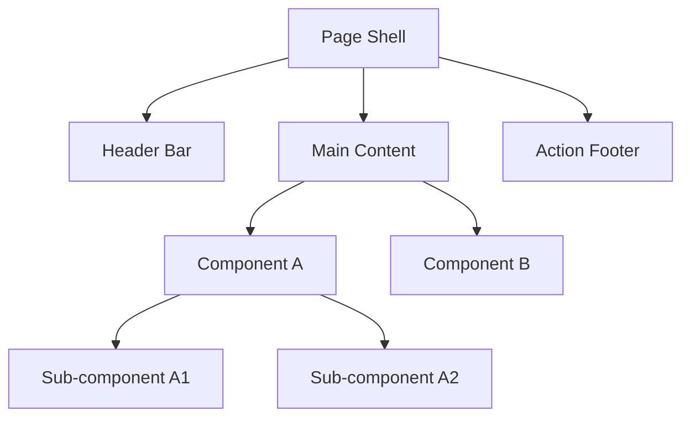
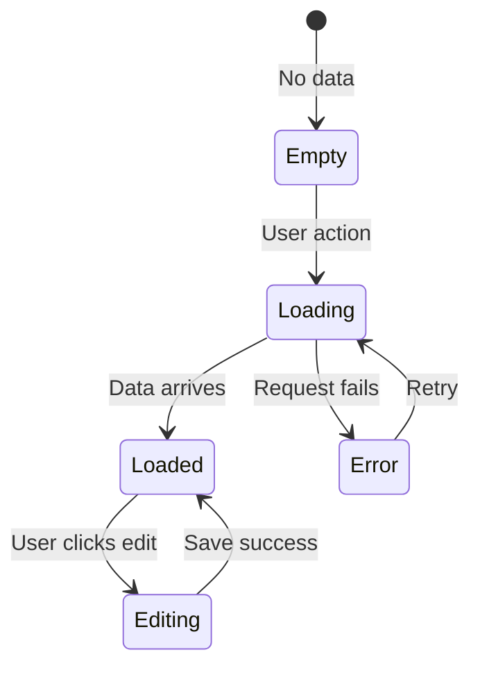

# Wireframe: [Feature Name]

**Date**: YYYY-MM-DD
**Feature**: [Feature name]
**Design Plan**: `.project/design/plans/YYYY-MM-DD-feature-name.md`
**Design System**: `.project/design/ux/design-system.md`

---

## Screen Layout

### Desktop (>= 1024px)

```
┌─ [Screen Name] ──────────────────────────────────────────────┐
│ ┌─ Header ─────────────────────────────────────────────────┐ │
│ │ [Title]                              [Action Button]     │ │
│ └──────────────────────────────────────────────────────────┘ │
│                                                              │
│ ┌─ Main Content ───────────────────────────────────────────┐ │
│ │                                                          │ │
│ │  [Component A]              [Component B]                │ │
│ │                                                          │ │
│ └──────────────────────────────────────────────────────────┘ │
│                                                              │
│ ┌─ Footer / Actions ──────────────────────────────────────┐ │
│ │ [Secondary Action]                    [Primary Action]   │ │
│ └──────────────────────────────────────────────────────────┘ │
└──────────────────────────────────────────────────────────────┘
```

### Tablet (768px – 1023px)

```
[Describe layout changes: stacked columns, hidden sidebar, etc.]
```

### Mobile (< 768px)

```
[Describe mobile layout: full-width, bottom sheet, etc.]
```

---

## Component Map



---

## State Transitions



---

## Interactive Elements

| Element | Type | Action | Feedback |
|---------|------|--------|----------|
| [Primary CTA] | Button | Submit form | Loading spinner → success toast |
| [List item] | Card | Navigate to detail | Hover: shadow-md, click: route change |
| [Filter] | Select | Filter list | Instant filter, no loading |
| [Delete] | Icon button | Confirm → delete | Dialog → success toast |

---

## Design Tokens Used

| Token | Value | Usage |
|-------|-------|-------|
| `--primary` | Arka Red | CTA buttons, active states |
| `--background` | cream-50 | Page background |
| `--card` | white | Card surfaces |
| `text-sm` | 14px | Labels, metadata |
| `rounded-lg` | 8px | Card corners |

---

## Accessibility Notes

- [ ] All interactive elements have visible focus indicators
- [ ] Color is not the only way to convey information
- [ ] Touch targets are >= 44x44px on mobile
- [ ] Screen reader flow follows visual order
- [ ] ARIA labels on icon-only buttons

---

## Open Questions

- [ ] [Question about layout or interaction not yet decided]
