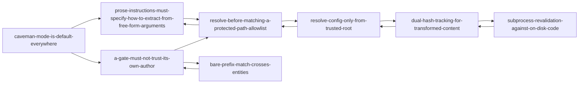

# Knowledge Index

Last updated: 2026-09-25 — generated by `node ai-framework/scripts/graphify.js`. Do not hand-edit; re-run the script instead.

## Decisions (1 entries)
- [caveman-mode-is-default-everywhere](decisions/caveman-mode-is-default-everywhere.md) — Decision: caveman brevity mode is the default for every skill, agent, and session

## Patterns (5 entries)
- [a-gate-must-not-trust-its-own-author](patterns/a-gate-must-not-trust-its-own-author.md) — Pattern: A safety gate must not accept the claims of whoever it is gating — and must re-check at the destructive step
- [dual-hash-tracking-for-transformed-content](patterns/dual-hash-tracking-for-transformed-content.md) — Pattern: Dual-hash tracking for content that gets transformed after fetch
- [resolve-before-matching-a-protected-path-allowlist](patterns/resolve-before-matching-a-protected-path-allowlist.md) — Pattern: Resolve the real path before matching it against a protected-directory list
- [resolve-config-only-from-trusted-root](patterns/resolve-config-only-from-trusted-root.md) — Pattern: When invoking a tool over untrusted content, resolve its config only from a trusted root
- [subprocess-revalidation-against-on-disk-code](patterns/subprocess-revalidation-against-on-disk-code.md) — Pattern: Re-validate a just-synced contract as a subprocess, not an in-process require

## Entities (0 entries)
_none yet_

## Issues (3 entries)
- [bare-prefix-match-crosses-entities](issues/bare-prefix-match-crosses-entities.md) — Issue: Matching entities by a bare `${id}-` prefix lets one entity resolve to another's
- [macos-tmpdir-realpath-alias-breaks-path-assertions](issues/macos-tmpdir-realpath-alias-breaks-path-assertions.md) — Issue: macOS resolves `os.tmpdir()` through a `/private/var` alias, breaking exact-path assertions in tests
- [prose-instructions-must-specify-how-to-extract-from-free-form-arguments](issues/prose-instructions-must-specify-how-to-extract-from-free-form-arguments.md) — Issue: A prose skill instruction referenced a CLI flag as if invocation arguments were already a clean single value, but they are free-form text

## Tag Index
- **all-vendors** (1) — caveman-mode-is-default-everywhere
- **case-sensitivity** (1) — resolve-before-matching-a-protected-path-allowlist
- **caveman** (1) — caveman-mode-is-default-everywhere
- **cli-integration** (1) — prose-instructions-must-specify-how-to-extract-from-free-form-arguments
- **data-integrity** (1) — bare-prefix-match-crosses-entities
- **defaults** (1) — caveman-mode-is-default-everywhere
- **deletion** (1) — a-gate-must-not-trust-its-own-author
- **filesystem** (2) — macos-tmpdir-realpath-alias-breaks-path-assertions, resolve-before-matching-a-protected-path-allowlist
- **formatting** (1) — dual-hash-tracking-for-transformed-content
- **gates** (1) — a-gate-must-not-trust-its-own-author
- **hashing** (1) — dual-hash-tracking-for-transformed-content
- **identifiers** (1) — bare-prefix-match-crosses-entities
- **macos** (1) — macos-tmpdir-realpath-alias-breaks-path-assertions
- **matching** (1) — bare-prefix-match-crosses-entities
- **migration** (1) — subprocess-revalidation-against-on-disk-code
- **node** (1) — macos-tmpdir-realpath-alias-breaks-path-assertions
- **ownership** (1) — dual-hash-tracking-for-transformed-content
- **prose-skill** (1) — prose-instructions-must-specify-how-to-extract-from-free-form-arguments
- **response-style** (1) — caveman-mode-is-default-everywhere
- **safety** (1) — a-gate-must-not-trust-its-own-author
- **schema-versioning** (1) — subprocess-revalidation-against-on-disk-code
- **security** (2) — resolve-before-matching-a-protected-path-allowlist, resolve-config-only-from-trusted-root
- **subprocess** (2) — resolve-config-only-from-trusted-root, subprocess-revalidation-against-on-disk-code
- **symlinks** (1) — resolve-before-matching-a-protected-path-allowlist
- **sync** (1) — subprocess-revalidation-against-on-disk-code
- **testing** (1) — macos-tmpdir-realpath-alias-breaks-path-assertions
- **testing-gap** (1) — prose-instructions-must-specify-how-to-extract-from-free-form-arguments
- **transactions** (1) — dual-hash-tracking-for-transformed-content
- **untrusted-content** (1) — resolve-config-only-from-trusted-root
- **validation** (1) — a-gate-must-not-trust-its-own-author

## Graph



## Traversal

Machine-readable graph: `.project/knowledge/graph.json` — `nodes[]` (id, type, title, tags, related, file), `edges[]` (`{from, to}` by id), and `tagIndex` (tag → node ids). Any phase or skill looking for prior knowledge should load `graph.json` and traverse it — filter by `type`, follow `related`/`edges`, or look up a `tag` — instead of re-scanning every markdown file under `knowledge/`. Rebuild after adding or editing an entry:

```
node ai-framework/scripts/graphify.js
```
