# Knowledge Index

Last updated: 2026-09-25 — generated by `node ai-framework/scripts/graphify.js`. Do not hand-edit; re-run the script instead.

## Decisions (1 entries)
- [caveman-mode-is-default-everywhere](decisions/caveman-mode-is-default-everywhere.md) — Decision: caveman brevity mode is the default for every skill, agent, and session

## Patterns (9 entries)
- [a-gate-must-not-trust-its-own-author](patterns/a-gate-must-not-trust-its-own-author.md) — Pattern: A safety gate must not accept the claims of whoever it is gating — and must re-check at the destructive step
- [a-report-over-an-untrusted-tree-runs-only-bundle-code](patterns/a-report-over-an-untrusted-tree-runs-only-bundle-code.md) — Pattern: a read-only report over a project tree treats the tree as data, never as code
- [allow-list-untrusted-labels-at-ingest-and-at-render](patterns/allow-list-untrusted-labels-at-ingest-and-at-render.md) — Pattern: Allow-list untrusted labels at ingest, and again at the place they are rendered
- [dual-hash-tracking-for-transformed-content](patterns/dual-hash-tracking-for-transformed-content.md) — Pattern: Dual-hash tracking for content that gets transformed after fetch
- [parse-untrusted-values-and-re-emit-them](patterns/parse-untrusted-values-and-re-emit-them.md) — Pattern: parse an untrusted value against a grammar and re-emit it from the parsed numbers
- [resolve-before-matching-a-protected-path-allowlist](patterns/resolve-before-matching-a-protected-path-allowlist.md) — Pattern: Resolve the real path before matching it against a protected-directory list
- [resolve-config-only-from-trusted-root](patterns/resolve-config-only-from-trusted-root.md) — Pattern: When invoking a tool over untrusted content, resolve its config only from a trusted root
- [reversible-aggregates-store-their-routing](patterns/reversible-aggregates-store-their-routing.md) — Pattern: When aggregates can be undone, store where each record was counted, and never clamp
- [subprocess-revalidation-against-on-disk-code](patterns/subprocess-revalidation-against-on-disk-code.md) — Pattern: Re-validate a just-synced contract as a subprocess, not an in-process require

## Entities (0 entries)
_none yet_

## Issues (7 entries)
- [async-agent-launch-hook-counted-as-completion](issues/async-agent-launch-hook-counted-as-completion.md) — Issue: A hook that fires at launch was counted as a completion, so async agents counted twice
- [bare-prefix-match-crosses-entities](issues/bare-prefix-match-crosses-entities.md) — Issue: Matching entities by a bare `${id}-` prefix lets one entity resolve to another's
- [hardening-a-shared-reader-made-its-writer-destructive](issues/hardening-a-shared-reader-made-its-writer-destructive.md) — Issue: making a shared reader treat a symlink as "absent" turned its writer into a data-destroyer
- [installed-skill-wrappers-ship-as-orphans](issues/installed-skill-wrappers-ship-as-orphans.md) — Issue: a skill installed in the source checkout ships to every synced project as a broken orphan
- [macos-tmpdir-realpath-alias-breaks-path-assertions](issues/macos-tmpdir-realpath-alias-breaks-path-assertions.md) — Issue: macOS resolves `os.tmpdir()` through a `/private/var` alias, breaking exact-path assertions in tests
- [prose-instructions-must-specify-how-to-extract-from-free-form-arguments](issues/prose-instructions-must-specify-how-to-extract-from-free-form-arguments.md) — Issue: A prose skill instruction referenced a CLI flag as if invocation arguments were already a clean single value, but they are free-form text
- [reviewer-reports-contradicted-by-measurement](issues/reviewer-reports-contradicted-by-measurement.md) — Issue: a subagent's audit report contained numbers and names the code and the test run contradicted

## Tag Index
- **aggregation** (1) — reversible-aggregates-store-their-routing
- **all-vendors** (1) — caveman-mode-is-default-everywhere
- **audit** (2) — hardening-a-shared-reader-made-its-writer-destructive, reviewer-reports-contradicted-by-measurement
- **bundle-sync** (1) — installed-skill-wrappers-ship-as-orphans
- **case-sensitivity** (1) — resolve-before-matching-a-protected-path-allowlist
- **caveman** (1) — caveman-mode-is-default-everywhere
- **claude-code** (1) — async-agent-launch-hook-counted-as-completion
- **cli-integration** (1) — prose-instructions-must-specify-how-to-extract-from-free-form-arguments
- **css** (1) — parse-untrusted-values-and-re-emit-them
- **data-integrity** (1) — bare-prefix-match-crosses-entities
- **data-loss** (1) — hardening-a-shared-reader-made-its-writer-destructive
- **defaults** (1) — caveman-mode-is-default-everywhere
- **deletion** (1) — a-gate-must-not-trust-its-own-author
- **double-counting** (1) — async-agent-launch-hook-counted-as-completion
- **filesystem** (2) — macos-tmpdir-realpath-alias-breaks-path-assertions, resolve-before-matching-a-protected-path-allowlist
- **formatting** (1) — dual-hash-tracking-for-transformed-content
- **gates** (1) — a-gate-must-not-trust-its-own-author
- **hashing** (1) — dual-hash-tracking-for-transformed-content
- **hooks** (1) — async-agent-launch-hook-counted-as-completion
- **identifiers** (1) — bare-prefix-match-crosses-entities
- **injection** (1) — parse-untrusted-values-and-re-emit-them
- **instance-data** (1) — installed-skill-wrappers-ship-as-orphans
- **macos** (1) — macos-tmpdir-realpath-alias-breaks-path-assertions
- **markdown** (1) — allow-list-untrusted-labels-at-ingest-and-at-render
- **matching** (1) — bare-prefix-match-crosses-entities
- **migration** (3) — installed-skill-wrappers-ship-as-orphans, reversible-aggregates-store-their-routing, subprocess-revalidation-against-on-disk-code
- **node** (1) — macos-tmpdir-realpath-alias-breaks-path-assertions
- **ownership** (1) — dual-hash-tracking-for-transformed-content
- **process** (1) — reviewer-reports-contradicted-by-measurement
- **prose-skill** (1) — prose-instructions-must-specify-how-to-extract-from-free-form-arguments
- **publishing** (1) — installed-skill-wrappers-ship-as-orphans
- **redos** (1) — a-report-over-an-untrusted-tree-runs-only-bundle-code
- **regression** (1) — hardening-a-shared-reader-made-its-writer-destructive
- **reports** (3) — a-report-over-an-untrusted-tree-runs-only-bundle-code, allow-list-untrusted-labels-at-ingest-and-at-render, parse-untrusted-values-and-re-emit-them
- **response-style** (1) — caveman-mode-is-default-everywhere
- **reversal** (1) — reversible-aggregates-store-their-routing
- **safety** (1) — a-gate-must-not-trust-its-own-author
- **schema-versioning** (2) — reversible-aggregates-store-their-routing, subprocess-revalidation-against-on-disk-code
- **security** (5) — a-report-over-an-untrusted-tree-runs-only-bundle-code, allow-list-untrusted-labels-at-ingest-and-at-render, parse-untrusted-values-and-re-emit-them, resolve-before-matching-a-protected-path-allowlist, resolve-config-only-from-trusted-root
- **shared-helpers** (1) — hardening-a-shared-reader-made-its-writer-destructive
- **subagents** (1) — reviewer-reports-contradicted-by-measurement
- **subprocess** (2) — resolve-config-only-from-trusted-root, subprocess-revalidation-against-on-disk-code
- **symlinks** (3) — a-report-over-an-untrusted-tree-runs-only-bundle-code, hardening-a-shared-reader-made-its-writer-destructive, resolve-before-matching-a-protected-path-allowlist
- **sync** (1) — subprocess-revalidation-against-on-disk-code
- **telemetry** (1) — async-agent-launch-hook-counted-as-completion
- **testing** (1) — macos-tmpdir-realpath-alias-breaks-path-assertions
- **testing-gap** (1) — prose-instructions-must-specify-how-to-extract-from-free-form-arguments
- **transactions** (1) — dual-hash-tracking-for-transformed-content
- **untrusted-content** (1) — resolve-config-only-from-trusted-root
- **untrusted-input** (3) — a-report-over-an-untrusted-tree-runs-only-bundle-code, allow-list-untrusted-labels-at-ingest-and-at-render, parse-untrusted-values-and-re-emit-them
- **validation** (1) — a-gate-must-not-trust-its-own-author
- **verification** (1) — reviewer-reports-contradicted-by-measurement

## Graph

```mermaid
graph LR
  caveman-mode-is-default-everywhere --> prose-instructions-must-specify-how-to-extract-from-free-form-arguments
  caveman-mode-is-default-everywhere --> a-gate-must-not-trust-its-own-author
  a-gate-must-not-trust-its-own-author --> resolve-before-matching-a-protected-path-allowlist
  a-gate-must-not-trust-its-own-author --> bare-prefix-match-crosses-entities
  a-report-over-an-untrusted-tree-runs-only-bundle-code --> subprocess-revalidation-against-on-disk-code
  a-report-over-an-untrusted-tree-runs-only-bundle-code --> resolve-config-only-from-trusted-root
  a-report-over-an-untrusted-tree-runs-only-bundle-code --> resolve-before-matching-a-protected-path-allowlist
  a-report-over-an-untrusted-tree-runs-only-bundle-code --> parse-untrusted-values-and-re-emit-them
  allow-list-untrusted-labels-at-ingest-and-at-render --> resolve-config-only-from-trusted-root
  allow-list-untrusted-labels-at-ingest-and-at-render --> a-gate-must-not-trust-its-own-author
  allow-list-untrusted-labels-at-ingest-and-at-render --> async-agent-launch-hook-counted-as-completion
  dual-hash-tracking-for-transformed-content --> subprocess-revalidation-against-on-disk-code
  dual-hash-tracking-for-transformed-content --> resolve-config-only-from-trusted-root
  parse-untrusted-values-and-re-emit-them --> allow-list-untrusted-labels-at-ingest-and-at-render
  parse-untrusted-values-and-re-emit-them --> resolve-config-only-from-trusted-root
  parse-untrusted-values-and-re-emit-them --> a-report-over-an-untrusted-tree-runs-only-bundle-code
  resolve-before-matching-a-protected-path-allowlist --> resolve-config-only-from-trusted-root
  resolve-before-matching-a-protected-path-allowlist --> prose-instructions-must-specify-how-to-extract-from-free-form-arguments
  resolve-config-only-from-trusted-root --> dual-hash-tracking-for-transformed-content
  resolve-config-only-from-trusted-root --> resolve-before-matching-a-protected-path-allowlist
  reversible-aggregates-store-their-routing --> subprocess-revalidation-against-on-disk-code
  reversible-aggregates-store-their-routing --> dual-hash-tracking-for-transformed-content
  reversible-aggregates-store-their-routing --> async-agent-launch-hook-counted-as-completion
  subprocess-revalidation-against-on-disk-code --> dual-hash-tracking-for-transformed-content
  async-agent-launch-hook-counted-as-completion --> bare-prefix-match-crosses-entities
  async-agent-launch-hook-counted-as-completion --> reversible-aggregates-store-their-routing
  bare-prefix-match-crosses-entities --> a-gate-must-not-trust-its-own-author
  hardening-a-shared-reader-made-its-writer-destructive --> a-report-over-an-untrusted-tree-runs-only-bundle-code
  hardening-a-shared-reader-made-its-writer-destructive --> resolve-before-matching-a-protected-path-allowlist
  hardening-a-shared-reader-made-its-writer-destructive --> a-gate-must-not-trust-its-own-author
  installed-skill-wrappers-ship-as-orphans --> caveman-mode-is-default-everywhere
  installed-skill-wrappers-ship-as-orphans --> a-gate-must-not-trust-its-own-author
  prose-instructions-must-specify-how-to-extract-from-free-form-arguments --> resolve-before-matching-a-protected-path-allowlist
  reviewer-reports-contradicted-by-measurement --> async-agent-launch-hook-counted-as-completion
  reviewer-reports-contradicted-by-measurement --> a-gate-must-not-trust-its-own-author
```



## Traversal

Machine-readable graph: `.project/knowledge/graph.json` — `nodes[]` (id, type, title, tags, related, file), `edges[]` (`{from, to}` by id), and `tagIndex` (tag → node ids). Any phase or skill looking for prior knowledge should load `graph.json` and traverse it — filter by `type`, follow `related`/`edges`, or look up a `tag` — instead of re-scanning every markdown file under `knowledge/`. Rebuild after adding or editing an entry:

```
node ai-framework/scripts/graphify.js
```
