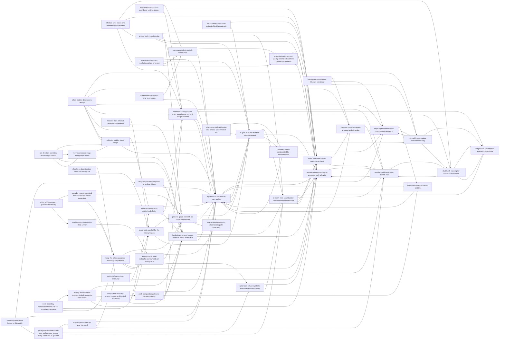

# Knowledge Index

Last updated: 2026-10-08 — generated by `node ai-framework/scripts/graphify.mts` (Graphify via uv). Do not hand-edit; re-run the script instead.

## Decisions (11 entries)
- [caveman-mode-is-default-everywhere](decisions/caveman-mode-is-default-everywhere.md) — Decision: caveman brevity mode is the default for every skill, agent, and session
- [collector-metrics-lease-design](decisions/collector-metrics-lease-design.md) — Decision: the metrics collector holds a kernel-owned loopback lease, not a lock file
- [compaction-recovery-shares-context-and-trusted-directories](decisions/compaction-recovery-shares-context-and-trusted-directories.md) — Decision: shared compaction recovery context and trusted directories
- [effective-sync-bases-and-bounded-font-discovery](decisions/effective-sync-bases-and-bounded-font-discovery.md) — Decision: Effective sync bases and bounded font discovery
- [inode-anchoring-and-stable-inode-locks](decisions/inode-anchoring-and-stable-inode-locks.md) — Decision: Inode anchoring and stable-inode locks
- [pitch-compaction-gate-and-recovery-design](decisions/pitch-compaction-gate-and-recovery-design.md) — Decision: how `/pitch-compress` decides a deletion is safe
- [project-state-report-design](decisions/project-state-report-design.md) — Decision: how `/state` builds its snapshot and themed HTML report
- [shape-lite-is-a-gated-escalating-variant-of-shape](decisions/shape-lite-is-a-gated-escalating-variant-of-shape.md) — Decision: `/shape-lite` is a compressed variant of `/shape` that escalates mechanically
- [skill-defaults-attribution-guard-and-runtime-design](decisions/skill-defaults-attribution-guard-and-runtime-design.md) — Decision: how the default-skills machinery attributes, guards, and reports readiness
- [token-metrics-dimensions-design](decisions/token-metrics-dimensions-design.md) — Decision: how token metrics record and report vendor, model, agent, effort and skill
- [workflow-tooling-pitches-share-standing-no-gos-and-design-answers](decisions/workflow-tooling-pitches-share-standing-no-gos-and-design-answers.md) — Decision: workflow-tooling pitches share the same no-gos, and the installer's design answers stand

## Patterns (25 entries)
- [a-gate-must-not-audit-its-own-instrument](patterns/a-gate-must-not-audit-its-own-instrument.md) — Pattern: the tool that verifies independence must itself be independently verified
- [a-gate-must-not-trust-its-own-author](patterns/a-gate-must-not-trust-its-own-author.md) — Pattern: A safety gate must not accept the claims of whoever it is gating — and must re-check at the destructive step
- [a-gate-spawns-exactly-what-it-probed](patterns/a-gate-spawns-exactly-what-it-probed.md) — Pattern: a launch gate spawns exactly the executable and role it verified
- [a-grader-reports-executed-and-unexecuted-cases-separately](patterns/a-grader-reports-executed-and-unexecuted-cases-separately.md) — Pattern: a grader reports executed and unexecuted cases separately
- [a-report-over-an-untrusted-tree-runs-only-bundle-code](patterns/a-report-over-an-untrusted-tree-runs-only-bundle-code.md) — Pattern: a read-only report over a project tree treats the tree as data, never as code
- [a-thin-cli-keeps-every-guard-in-the-library](patterns/a-thin-cli-keeps-every-guard-in-the-library.md) — Pattern: a thin CLI keeps every guard in the library
- [allow-list-untrusted-labels-at-ingest-and-at-render](patterns/allow-list-untrusted-labels-at-ingest-and-at-render.md) — Pattern: Allow-list untrusted labels at ingest, and again at the place they are rendered
- [checks-on-doc-structure-name-the-owning-file](patterns/checks-on-doc-structure-name-the-owning-file.md) — Pattern: structure checks on documentation name the file that owns each heading
- [display-buckets-are-not-lifecycle-identities](patterns/display-buckets-are-not-lifecycle-identities.md) — Pattern: lossy display buckets cannot identify a lifecycle
- [dual-hash-tracking-for-transformed-content](patterns/dual-hash-tracking-for-transformed-content.md) — Pattern: Dual-hash tracking for content that gets transformed after fetch
- [git-against-a-workers-tree-runs-worker-code-unless-every-command-is-guarded](patterns/git-against-a-workers-tree-runs-worker-code-unless-every-command-is-guarded.md) — Pattern: git run against a worker's tree executes worker code unless every command is guarded
- [keep-the-fakes-guarantee-the-thing-they-replace](patterns/keep-the-fakes-guarantee-the-thing-they-replace.md) — Pattern: keep the fake's guarantee the same as the thing it replaces
- [one-boundary-selects-the-child-runner](patterns/one-boundary-selects-the-child-runner.md) — Pattern: one boundary picks the child runner
- [opt-in-before-runtime-discovery](patterns/opt-in-before-runtime-discovery.md) — Pattern: explicit opt-in precedes runtime discovery
- [parse-untrusted-values-and-re-emit-them](patterns/parse-untrusted-values-and-re-emit-them.md) — Pattern: parse an untrusted value against a grammar and re-emit it from the parsed numbers
- [pin-directory-identities-across-async-leases](patterns/pin-directory-identities-across-async-leases.md) — Pattern: carry directory identity through an asynchronous lease
- [prove-a-guard-test-with-an-in-memory-mutant](patterns/prove-a-guard-test-with-an-in-memory-mutant.md) — Pattern: prove a guard test guards by running it against an in-memory mutant
- [resolve-before-matching-a-protected-path-allowlist](patterns/resolve-before-matching-a-protected-path-allowlist.md) — Pattern: Resolve the real path before matching it against a protected-directory list
- [resolve-config-only-from-trusted-root](patterns/resolve-config-only-from-trusted-root.md) — Pattern: When invoking a tool over untrusted content, resolve its config only from a trusted root
- [retry-only-on-positive-proof-of-a-clean-failure](patterns/retry-only-on-positive-proof-of-a-clean-failure.md) — Pattern: retry a launch only on positive proof that the failure left nothing behind
- [reversible-aggregates-store-their-routing](patterns/reversible-aggregates-store-their-routing.md) — Pattern: When aggregates can be undone, store where each record was counted, and never clamp
- [settle-only-with-proof-bound-to-this-patch](patterns/settle-only-with-proof-bound-to-this-patch.md) — Pattern: settle an attempt only with proof bound to this attempt's patch, and make reruns re-prove it
- [subprocess-revalidation-against-on-disk-code](patterns/subprocess-revalidation-against-on-disk-code.md) — Pattern: Re-validate a just-synced contract as a subprocess, not an in-process require
- [sync-tools-refuse-symlinks-in-source-and-destination](patterns/sync-tools-refuse-symlinks-in-source-and-destination.md) — Pattern: a copy/prune tool refuses symlinks on both sides
- [word-boundary-replacement-does-not-see-a-prefixed-property](patterns/word-boundary-replacement-does-not-see-a-prefixed-property.md) — Pattern: a word-boundary search-and-replace still matches inside a longer identifier

## Entities (0 entries)
_none yet_

## Issues (14 entries)
- [a-temp-helper-that-realpaths-silently-voids-an-alias-guard](issues/a-temp-helper-that-realpaths-silently-voids-an-alias-guard.md) — Issue: a temp-fixture helper that realpaths its result silently voids a macOS alias guard
- [async-agent-launch-hook-counted-as-completion](issues/async-agent-launch-hook-counted-as-completion.md) — Issue: A hook that fires at launch was counted as a completion, so async agents counted twice
- [backtracking-regex-over-untrusted-text-is-quadratic](issues/backtracking-regex-over-untrusted-text-is-quadratic.md) — Issue: a lazy fence-stripping regex over CLAUDE.md was quadratic
- [bare-prefix-match-crosses-entities](issues/bare-prefix-match-crosses-entities.md) — Issue: Matching entities by a bare `${id}-` prefix lets one entity resolve to another's
- [false-cross-pitch-attribution-in-a-shared-uncommitted-file](issues/false-cross-pitch-attribution-in-a-shared-uncommitted-file.md) — Issue: a cross-pitch-conflict-checker cannot separate authorship in a file two uncommitted pitches share
- [guard-tests-can-fail-for-the-wrong-reason](issues/guard-tests-can-fail-for-the-wrong-reason.md) — Issue: guard tests can fail for the wrong reason
- [hardening-a-shared-reader-made-its-writer-destructive](issues/hardening-a-shared-reader-made-its-writer-destructive.md) — Issue: making a shared reader treat a symlink as "absent" turned its writer into a data-destroyer
- [installed-skill-wrappers-ship-as-orphans](issues/installed-skill-wrappers-ship-as-orphans.md) — Issue: a skill installed in the source checkout ships to every synced project as a broken orphan
- [macos-tmpdir-realpath-alias-breaks-path-assertions](issues/macos-tmpdir-realpath-alias-breaks-path-assertions.md) — Issue: macOS resolves `os.tmpdir()` through a `/private/var` alias, breaking exact-path assertions in tests
- [metrics-ancestor-swap-during-async-lease](issues/metrics-ancestor-swap-during-async-lease.md) — Issue: a directory checked before an asynchronous lease can change before use
- [prose-instructions-must-specify-how-to-extract-from-free-form-arguments](issues/prose-instructions-must-specify-how-to-extract-from-free-form-arguments.md) — Issue: A prose skill instruction referenced a CLI flag as if invocation arguments were already a clean single value, but they are free-form text
- [reusing-a-transaction-exposes-its-lock-reader-to-new-callers](issues/reusing-a-transaction-exposes-its-lock-reader-to-new-callers.md) — Issue: reusing skill-registry transactions for ledger commits exposed their lock read to FIFOs and huge files
- [reviewer-reports-contradicted-by-measurement](issues/reviewer-reports-contradicted-by-measurement.md) — Issue: a subagent's audit report contained numbers and names the code and the test run contradicted
- [rounded-zero-timeout-disables-cancellation](issues/rounded-zero-timeout-disables-cancellation.md) — Issue: rounding a remaining budget to zero disables subprocess cancellation

## Tag Index
- **aggregation** (2) — display-buckets-are-not-lifecycle-identities, reversible-aggregates-store-their-routing
- **all-vendors** (1) — caveman-mode-is-default-everywhere
- **architecture** (1) — workflow-tooling-pitches-share-standing-no-gos-and-design-answers
- **attribution** (1) — display-buckets-are-not-lifecycle-identities
- **audit** (4) — hardening-a-shared-reader-made-its-writer-destructive, prove-a-guard-test-with-an-in-memory-mutant, reusing-a-transaction-exposes-its-lock-reader-to-new-callers, reviewer-reports-contradicted-by-measurement
- **bun** (1) — one-boundary-selects-the-child-runner
- **bundle-sync** (5) — checks-on-doc-structure-name-the-owning-file, effective-sync-bases-and-bounded-font-discovery, installed-skill-wrappers-ship-as-orphans, sync-tools-refuse-symlinks-in-source-and-destination, workflow-tooling-pitches-share-standing-no-gos-and-design-answers
- **case-sensitivity** (1) — resolve-before-matching-a-protected-path-allowlist
- **caveman** (2) — caveman-mode-is-default-everywhere, skill-defaults-attribution-guard-and-runtime-design
- **child-process** (1) — one-boundary-selects-the-child-runner
- **claude-code** (1) — async-agent-launch-hook-counted-as-completion
- **cli** (1) — a-thin-cli-keeps-every-guard-in-the-library
- **cli-integration** (1) — prose-instructions-must-specify-how-to-extract-from-free-form-arguments
- **collector** (3) — collector-metrics-lease-design, inode-anchoring-and-stable-inode-locks, token-metrics-dimensions-design
- **compaction** (2) — compaction-recovery-shares-context-and-trusted-directories, pitch-compaction-gate-and-recovery-design
- **compress-guard** (1) — skill-defaults-attribution-guard-and-runtime-design
- **concurrency** (2) — collector-metrics-lease-design, metrics-ancestor-swap-during-async-lease
- **configuration** (1) — opt-in-before-runtime-discovery
- **cross-pitch** (1) — false-cross-pitch-attribution-in-a-shared-uncommitted-file
- **cross-vendor** (1) — shape-lite-is-a-gated-escalating-variant-of-shape
- **css** (2) — effective-sync-bases-and-bounded-font-discovery, parse-untrusted-values-and-re-emit-them
- **data-integrity** (1) — bare-prefix-match-crosses-entities
- **data-loss** (1) — hardening-a-shared-reader-made-its-writer-destructive
- **defaults** (2) — caveman-mode-is-default-everywhere, skill-defaults-attribution-guard-and-runtime-design
- **deletion** (2) — a-gate-must-not-trust-its-own-author, pitch-compaction-gate-and-recovery-design
- **design** (5) — effective-sync-bases-and-bounded-font-discovery, pitch-compaction-gate-and-recovery-design, project-state-report-design, skill-defaults-attribution-guard-and-runtime-design, token-metrics-dimensions-design
- **documentation** (1) — checks-on-doc-structure-name-the-owning-file
- **double-counting** (1) — async-agent-launch-hook-counted-as-completion
- **entry-files** (1) — backtracking-regex-over-untrusted-text-is-quadratic
- **escalation** (1) — shape-lite-is-a-gated-escalating-variant-of-shape
- **evals** (1) — a-grader-reports-executed-and-unexecuted-cases-separately
- **evidence** (1) — settle-only-with-proof-bound-to-this-patch
- **fakes** (1) — keep-the-fakes-guarantee-the-thing-they-replace
- **fallback** (1) — opt-in-before-runtime-discovery
- **false-positive** (1) — false-cross-pitch-attribution-in-a-shared-uncommitted-file
- **feasibility** (1) — inode-anchoring-and-stable-inode-locks
- **fifo** (1) — reusing-a-transaction-exposes-its-lock-reader-to-new-callers
- **filesystem** (8) — a-temp-helper-that-realpaths-silently-voids-an-alias-guard, guard-tests-can-fail-for-the-wrong-reason, inode-anchoring-and-stable-inode-locks, macos-tmpdir-realpath-alias-breaks-path-assertions, metrics-ancestor-swap-during-async-lease, pin-directory-identities-across-async-leases, resolve-before-matching-a-protected-path-allowlist, sync-tools-refuse-symlinks-in-source-and-destination
- **fixtures** (1) — guard-tests-can-fail-for-the-wrong-reason
- **fonts** (1) — effective-sync-bases-and-bounded-font-discovery
- **formatting** (1) — dual-hash-tracking-for-transformed-content
- **gates** (4) — a-gate-must-not-trust-its-own-author, a-gate-spawns-exactly-what-it-probed, pitch-compaction-gate-and-recovery-design, shape-lite-is-a-gated-escalating-variant-of-shape
- **git** (1) — git-against-a-workers-tree-runs-worker-code-unless-every-command-is-guarded
- **grader** (1) — a-grader-reports-executed-and-unexecuted-cases-separately
- **guards** (2) — a-thin-cli-keeps-every-guard-in-the-library, keep-the-fakes-guarantee-the-thing-they-replace
- **hashing** (1) — dual-hash-tracking-for-transformed-content
- **helpers** (1) — a-temp-helper-that-realpaths-silently-voids-an-alias-guard
- **honesty** (1) — a-grader-reports-executed-and-unexecuted-cases-separately
- **hooks** (3) — async-agent-launch-hook-counted-as-completion, one-boundary-selects-the-child-runner, token-metrics-dimensions-design
- **html** (1) — project-state-report-design
- **idempotency** (1) — settle-only-with-proof-bound-to-this-patch
- **identifiers** (1) — bare-prefix-match-crosses-entities
- **identity** (1) — display-buckets-are-not-lifecycle-identities
- **injection** (1) — parse-untrusted-values-and-re-emit-them
- **installer** (1) — workflow-tooling-pitches-share-standing-no-gos-and-design-answers
- **instance-data** (1) — installed-skill-wrappers-ship-as-orphans
- **links** (1) — checks-on-doc-structure-name-the-owning-file
- **locking** (3) — collector-metrics-lease-design, inode-anchoring-and-stable-inode-locks, pin-directory-identities-across-async-leases
- **locks** (1) — reusing-a-transaction-exposes-its-lock-reader-to-new-callers
- **macos** (2) — a-temp-helper-that-realpaths-silently-voids-an-alias-guard, macos-tmpdir-realpath-alias-breaks-path-assertions
- **markdown** (1) — allow-list-untrusted-labels-at-ingest-and-at-render
- **matching** (1) — bare-prefix-match-crosses-entities
- **merge-base** (1) — effective-sync-bases-and-bounded-font-discovery
- **metrics** (3) — display-buckets-are-not-lifecycle-identities, metrics-ancestor-swap-during-async-lease, pin-directory-identities-across-async-leases
- **migration** (5) — collector-metrics-lease-design, compaction-recovery-shares-context-and-trusted-directories, installed-skill-wrappers-ship-as-orphans, reversible-aggregates-store-their-routing, subprocess-revalidation-against-on-disk-code
- **mutation** (2) — guard-tests-can-fail-for-the-wrong-reason, prove-a-guard-test-with-an-in-memory-mutant
- **no-gos** (1) — workflow-tooling-pitches-share-standing-no-gos-and-design-answers
- **node** (3) — macos-tmpdir-realpath-alias-breaks-path-assertions, one-boundary-selects-the-child-runner, rounded-zero-timeout-disables-cancellation
- **orchestration** (3) — opt-in-before-runtime-discovery, retry-only-on-positive-proof-of-a-clean-failure, settle-only-with-proof-bound-to-this-patch
- **ownership** (1) — dual-hash-tracking-for-transformed-content
- **path-safety** (4) — compaction-recovery-shares-context-and-trusted-directories, inode-anchoring-and-stable-inode-locks, prove-a-guard-test-with-an-in-memory-mutant, reusing-a-transaction-exposes-its-lock-reader-to-new-callers
- **phases** (1) — a-thin-cli-keeps-every-guard-in-the-library
- **pitch-compress** (1) — pitch-compaction-gate-and-recovery-design
- **platform** (2) — collector-metrics-lease-design, inode-anchoring-and-stable-inode-locks
- **process** (1) — reviewer-reports-contradicted-by-measurement
- **prose-skill** (1) — prose-instructions-must-specify-how-to-extract-from-free-form-arguments
- **publishing** (1) — installed-skill-wrappers-ship-as-orphans
- **recovery** (2) — compaction-recovery-shares-context-and-trusted-directories, pitch-compaction-gate-and-recovery-design
- **redos** (2) — a-report-over-an-untrusted-tree-runs-only-bundle-code, backtracking-regex-over-untrusted-text-is-quadratic
- **refactor** (2) — checks-on-doc-structure-name-the-owning-file, word-boundary-replacement-does-not-see-a-prefixed-property
- **regex** (1) — backtracking-regex-over-untrusted-text-is-quadratic
- **regression** (1) — hardening-a-shared-reader-made-its-writer-destructive
- **report** (1) — token-metrics-dimensions-design
- **reports** (3) — a-report-over-an-untrusted-tree-runs-only-bundle-code, allow-list-untrusted-labels-at-ingest-and-at-render, parse-untrusted-values-and-re-emit-them
- **response-style** (1) — caveman-mode-is-default-everywhere
- **retries** (1) — retry-only-on-positive-proof-of-a-clean-failure
- **reversal** (1) — reversible-aggregates-store-their-routing
- **review-tooling** (1) — a-gate-must-not-audit-its-own-instrument
- **reviews** (1) — word-boundary-replacement-does-not-see-a-prefixed-property
- **runner** (1) — one-boundary-selects-the-child-runner
- **runtime** (3) — a-temp-helper-that-realpaths-silently-voids-an-alias-guard, keep-the-fakes-guarantee-the-thing-they-replace, one-boundary-selects-the-child-runner
- **runtime-injection** (1) — pin-directory-identities-across-async-leases
- **safety** (2) — a-gate-must-not-trust-its-own-author, retry-only-on-positive-proof-of-a-clean-failure
- **schema** (1) — token-metrics-dimensions-design
- **schema-versioning** (2) — reversible-aggregates-store-their-routing, subprocess-revalidation-against-on-disk-code
- **security** (14) — a-gate-must-not-audit-its-own-instrument, a-gate-spawns-exactly-what-it-probed, a-report-over-an-untrusted-tree-runs-only-bundle-code, a-thin-cli-keeps-every-guard-in-the-library, allow-list-untrusted-labels-at-ingest-and-at-render, git-against-a-workers-tree-runs-worker-code-unless-every-command-is-guarded, metrics-ancestor-swap-during-async-lease, opt-in-before-runtime-discovery, parse-untrusted-values-and-re-emit-them, pin-directory-identities-across-async-leases, resolve-before-matching-a-protected-path-allowlist, resolve-config-only-from-trusted-root, rounded-zero-timeout-disables-cancellation, sync-tools-refuse-symlinks-in-source-and-destination
- **self-audit** (1) — a-gate-must-not-audit-its-own-instrument
- **setup-validator** (1) — backtracking-regex-over-untrusted-text-is-quadratic
- **shape** (1) — shape-lite-is-a-gated-escalating-variant-of-shape
- **shape-lite** (1) — shape-lite-is-a-gated-escalating-variant-of-shape
- **shared-helpers** (2) — hardening-a-shared-reader-made-its-writer-destructive, reusing-a-transaction-exposes-its-lock-reader-to-new-callers
- **shell** (1) — word-boundary-replacement-does-not-see-a-prefixed-property
- **skills** (1) — skill-defaults-attribution-guard-and-runtime-design
- **small-batch** (1) — shape-lite-is-a-gated-escalating-variant-of-shape
- **snapshot** (1) — project-state-report-design
- **state-report** (2) — effective-sync-bases-and-bounded-font-discovery, project-state-report-design
- **subagents** (1) — reviewer-reports-contradicted-by-measurement
- **subprocess** (6) — a-gate-spawns-exactly-what-it-probed, git-against-a-workers-tree-runs-worker-code-unless-every-command-is-guarded, opt-in-before-runtime-discovery, resolve-config-only-from-trusted-root, rounded-zero-timeout-disables-cancellation, subprocess-revalidation-against-on-disk-code
- **symlinks** (4) — a-report-over-an-untrusted-tree-runs-only-bundle-code, hardening-a-shared-reader-made-its-writer-destructive, metrics-ancestor-swap-during-async-lease, resolve-before-matching-a-protected-path-allowlist
- **sync** (1) — subprocess-revalidation-against-on-disk-code
- **telemetry** (1) — async-agent-launch-hook-counted-as-completion
- **testing** (6) — a-grader-reports-executed-and-unexecuted-cases-separately, a-temp-helper-that-realpaths-silently-voids-an-alias-guard, guard-tests-can-fail-for-the-wrong-reason, keep-the-fakes-guarantee-the-thing-they-replace, macos-tmpdir-realpath-alias-breaks-path-assertions, prove-a-guard-test-with-an-in-memory-mutant
- **testing-gap** (1) — prose-instructions-must-specify-how-to-extract-from-free-form-arguments
- **theme** (1) — project-state-report-design
- **threat-model** (1) — compaction-recovery-shares-context-and-trusted-directories
- **timeout** (1) — rounded-zero-timeout-disables-cancellation
- **token-metrics** (3) — collector-metrics-lease-design, skill-defaults-attribution-guard-and-runtime-design, token-metrics-dimensions-design
- **tooling** (2) — word-boundary-replacement-does-not-see-a-prefixed-property, workflow-tooling-pitches-share-standing-no-gos-and-design-answers
- **transactions** (3) — compaction-recovery-shares-context-and-trusted-directories, dual-hash-tracking-for-transformed-content, reusing-a-transaction-exposes-its-lock-reader-to-new-callers
- **untrusted-content** (2) — git-against-a-workers-tree-runs-worker-code-unless-every-command-is-guarded, resolve-config-only-from-trusted-root
- **untrusted-input** (4) — a-report-over-an-untrusted-tree-runs-only-bundle-code, allow-list-untrusted-labels-at-ingest-and-at-render, backtracking-regex-over-untrusted-text-is-quadratic, parse-untrusted-values-and-re-emit-them
- **validation** (2) — a-gate-must-not-trust-its-own-author, display-buckets-are-not-lifecycle-identities
- **verification** (3) — false-cross-pitch-attribution-in-a-shared-uncommitted-file, prove-a-guard-test-with-an-in-memory-mutant, reviewer-reports-contradicted-by-measurement
- **workflow** (2) — shape-lite-is-a-gated-escalating-variant-of-shape, workflow-tooling-pitches-share-standing-no-gos-and-design-answers
- **workflow-doctor** (1) — checks-on-doc-structure-name-the-owning-file
- **workflow-tooling** (2) — a-gate-must-not-audit-its-own-instrument, false-cross-pitch-attribution-in-a-shared-uncommitted-file

## Graph


```mermaid
graph LR
  caveman-mode-is-default-everywhere --> prose-instructions-must-specify-how-to-extract-from-free-form-arguments
  caveman-mode-is-default-everywhere --> a-gate-must-not-trust-its-own-author
  project-state-report-design --> parse-untrusted-values-and-re-emit-them
  project-state-report-design --> a-report-over-an-untrusted-tree-runs-only-bundle-code
  project-state-report-design --> hardening-a-shared-reader-made-its-writer-destructive
  project-state-report-design --> workflow-tooling-pitches-share-standing-no-gos-and-design-answers
  project-state-report-design --> resolve-before-matching-a-protected-path-allowlist
  project-state-report-design --> a-gate-must-not-audit-its-own-instrument
  effective-sync-bases-and-bounded-font-discovery --> dual-hash-tracking-for-transformed-content
  effective-sync-bases-and-bounded-font-discovery --> parse-untrusted-values-and-re-emit-them
  effective-sync-bases-and-bounded-font-discovery --> project-state-report-design
  effective-sync-bases-and-bounded-font-discovery --> workflow-tooling-pitches-share-standing-no-gos-and-design-answers
  skill-defaults-attribution-guard-and-runtime-design --> caveman-mode-is-default-everywhere
  skill-defaults-attribution-guard-and-runtime-design --> resolve-before-matching-a-protected-path-allowlist
  skill-defaults-attribution-guard-and-runtime-design --> workflow-tooling-pitches-share-standing-no-gos-and-design-answers
  token-metrics-dimensions-design --> reversible-aggregates-store-their-routing
  token-metrics-dimensions-design --> allow-list-untrusted-labels-at-ingest-and-at-render
  token-metrics-dimensions-design --> async-agent-launch-hook-counted-as-completion
  token-metrics-dimensions-design --> workflow-tooling-pitches-share-standing-no-gos-and-design-answers
  token-metrics-dimensions-design --> false-cross-pitch-attribution-in-a-shared-uncommitted-file
  token-metrics-dimensions-design --> collector-metrics-lease-design
  inode-anchoring-and-stable-inode-locks --> a-gate-must-not-trust-its-own-author
  inode-anchoring-and-stable-inode-locks --> workflow-tooling-pitches-share-standing-no-gos-and-design-answers
  inode-anchoring-and-stable-inode-locks --> hardening-a-shared-reader-made-its-writer-destructive
  workflow-tooling-pitches-share-standing-no-gos-and-design-answers --> resolve-config-only-from-trusted-root
  workflow-tooling-pitches-share-standing-no-gos-and-design-answers --> subprocess-revalidation-against-on-disk-code
  workflow-tooling-pitches-share-standing-no-gos-and-design-answers --> dual-hash-tracking-for-transformed-content
  workflow-tooling-pitches-share-standing-no-gos-and-design-answers --> a-gate-must-not-trust-its-own-author
  workflow-tooling-pitches-share-standing-no-gos-and-design-answers --> macos-tmpdir-realpath-alias-breaks-path-assertions
  compaction-recovery-shares-context-and-trusted-directories --> pitch-compaction-gate-and-recovery-design
  compaction-recovery-shares-context-and-trusted-directories --> inode-anchoring-and-stable-inode-locks
  compaction-recovery-shares-context-and-trusted-directories --> hardening-a-shared-reader-made-its-writer-destructive
  shape-lite-is-a-gated-escalating-variant-of-shape --> a-gate-must-not-trust-its-own-author
  shape-lite-is-a-gated-escalating-variant-of-shape --> a-gate-must-not-audit-its-own-instrument
  shape-lite-is-a-gated-escalating-variant-of-shape --> caveman-mode-is-default-everywhere
  shape-lite-is-a-gated-escalating-variant-of-shape --> prose-instructions-must-specify-how-to-extract-from-free-form-arguments
  collector-metrics-lease-design --> inode-anchoring-and-stable-inode-locks
  collector-metrics-lease-design --> token-metrics-dimensions-design
  collector-metrics-lease-design --> reversible-aggregates-store-their-routing
  collector-metrics-lease-design --> a-gate-must-not-trust-its-own-author
  pitch-compaction-gate-and-recovery-design --> a-gate-must-not-trust-its-own-author
  pitch-compaction-gate-and-recovery-design --> bare-prefix-match-crosses-entities
  pitch-compaction-gate-and-recovery-design --> hardening-a-shared-reader-made-its-writer-destructive
  pitch-compaction-gate-and-recovery-design --> workflow-tooling-pitches-share-standing-no-gos-and-design-answers
  subprocess-revalidation-against-on-disk-code --> dual-hash-tracking-for-transformed-content
  opt-in-before-runtime-discovery --> resolve-config-only-from-trusted-root
  opt-in-before-runtime-discovery --> parse-untrusted-values-and-re-emit-them
  opt-in-before-runtime-discovery --> guard-tests-can-fail-for-the-wrong-reason
  a-gate-must-not-trust-its-own-author --> resolve-before-matching-a-protected-path-allowlist
  a-gate-must-not-trust-its-own-author --> bare-prefix-match-crosses-entities
  a-gate-must-not-trust-its-own-author --> a-gate-must-not-audit-its-own-instrument
  display-buckets-are-not-lifecycle-identities --> allow-list-untrusted-labels-at-ingest-and-at-render
  display-buckets-are-not-lifecycle-identities --> async-agent-launch-hook-counted-as-completion
  display-buckets-are-not-lifecycle-identities --> reversible-aggregates-store-their-routing
  pin-directory-identities-across-async-leases --> collector-metrics-lease-design
  pin-directory-identities-across-async-leases --> metrics-ancestor-swap-during-async-lease
  pin-directory-identities-across-async-leases --> hardening-a-shared-reader-made-its-writer-destructive
  reversible-aggregates-store-their-routing --> subprocess-revalidation-against-on-disk-code
  reversible-aggregates-store-their-routing --> dual-hash-tracking-for-transformed-content
  reversible-aggregates-store-their-routing --> async-agent-launch-hook-counted-as-completion
  resolve-before-matching-a-protected-path-allowlist --> resolve-config-only-from-trusted-root
  resolve-before-matching-a-protected-path-allowlist --> prose-instructions-must-specify-how-to-extract-from-free-form-arguments
  one-boundary-selects-the-child-runner --> keep-the-fakes-guarantee-the-thing-they-replace
  one-boundary-selects-the-child-runner --> a-temp-helper-that-realpaths-silently-voids-an-alias-guard
  dual-hash-tracking-for-transformed-content --> subprocess-revalidation-against-on-disk-code
  dual-hash-tracking-for-transformed-content --> resolve-config-only-from-trusted-root
  keep-the-fakes-guarantee-the-thing-they-replace --> prove-a-guard-test-with-an-in-memory-mutant
  keep-the-fakes-guarantee-the-thing-they-replace --> parse-untrusted-values-and-re-emit-them
  keep-the-fakes-guarantee-the-thing-they-replace --> a-temp-helper-that-realpaths-silently-voids-an-alias-guard
  a-report-over-an-untrusted-tree-runs-only-bundle-code --> subprocess-revalidation-against-on-disk-code
  a-report-over-an-untrusted-tree-runs-only-bundle-code --> resolve-config-only-from-trusted-root
  a-report-over-an-untrusted-tree-runs-only-bundle-code --> resolve-before-matching-a-protected-path-allowlist
  a-report-over-an-untrusted-tree-runs-only-bundle-code --> parse-untrusted-values-and-re-emit-them
  git-against-a-workers-tree-runs-worker-code-unless-every-command-is-guarded --> a-gate-spawns-exactly-what-it-probed
  git-against-a-workers-tree-runs-worker-code-unless-every-command-is-guarded --> sync-tools-refuse-symlinks-in-source-and-destination
  git-against-a-workers-tree-runs-worker-code-unless-every-command-is-guarded --> a-report-over-an-untrusted-tree-runs-only-bundle-code
  sync-tools-refuse-symlinks-in-source-and-destination --> resolve-before-matching-a-protected-path-allowlist
  sync-tools-refuse-symlinks-in-source-and-destination --> a-report-over-an-untrusted-tree-runs-only-bundle-code
  a-gate-spawns-exactly-what-it-probed --> a-gate-must-not-trust-its-own-author
  a-gate-spawns-exactly-what-it-probed --> opt-in-before-runtime-discovery
  a-gate-spawns-exactly-what-it-probed --> resolve-config-only-from-trusted-root
  allow-list-untrusted-labels-at-ingest-and-at-render --> resolve-config-only-from-trusted-root
  allow-list-untrusted-labels-at-ingest-and-at-render --> a-gate-must-not-trust-its-own-author
  allow-list-untrusted-labels-at-ingest-and-at-render --> async-agent-launch-hook-counted-as-completion
  parse-untrusted-values-and-re-emit-them --> allow-list-untrusted-labels-at-ingest-and-at-render
  parse-untrusted-values-and-re-emit-them --> resolve-config-only-from-trusted-root
  parse-untrusted-values-and-re-emit-them --> a-report-over-an-untrusted-tree-runs-only-bundle-code
  checks-on-doc-structure-name-the-owning-file --> opt-in-before-runtime-discovery
  checks-on-doc-structure-name-the-owning-file --> guard-tests-can-fail-for-the-wrong-reason
  resolve-config-only-from-trusted-root --> dual-hash-tracking-for-transformed-content
  resolve-config-only-from-trusted-root --> resolve-before-matching-a-protected-path-allowlist
  a-thin-cli-keeps-every-guard-in-the-library --> a-grader-reports-executed-and-unexecuted-cases-separately
  a-thin-cli-keeps-every-guard-in-the-library --> one-boundary-selects-the-child-runner
  prove-a-guard-test-with-an-in-memory-mutant --> a-gate-must-not-audit-its-own-instrument
  prove-a-guard-test-with-an-in-memory-mutant --> a-gate-must-not-trust-its-own-author
  prove-a-guard-test-with-an-in-memory-mutant --> macos-tmpdir-realpath-alias-breaks-path-assertions
  a-gate-must-not-audit-its-own-instrument --> a-gate-must-not-trust-its-own-author
  a-gate-must-not-audit-its-own-instrument --> a-report-over-an-untrusted-tree-runs-only-bundle-code
  a-gate-must-not-audit-its-own-instrument --> resolve-before-matching-a-protected-path-allowlist
  a-gate-must-not-audit-its-own-instrument --> reviewer-reports-contradicted-by-measurement
  word-boundary-replacement-does-not-see-a-prefixed-property --> reusing-a-transaction-exposes-its-lock-reader-to-new-callers
  word-boundary-replacement-does-not-see-a-prefixed-property --> guard-tests-can-fail-for-the-wrong-reason
  word-boundary-replacement-does-not-see-a-prefixed-property --> keep-the-fakes-guarantee-the-thing-they-replace
  a-grader-reports-executed-and-unexecuted-cases-separately --> prove-a-guard-test-with-an-in-memory-mutant
  a-grader-reports-executed-and-unexecuted-cases-separately --> keep-the-fakes-guarantee-the-thing-they-replace
  retry-only-on-positive-proof-of-a-clean-failure --> async-agent-launch-hook-counted-as-completion
  retry-only-on-positive-proof-of-a-clean-failure --> hardening-a-shared-reader-made-its-writer-destructive
  retry-only-on-positive-proof-of-a-clean-failure --> a-gate-must-not-trust-its-own-author
  settle-only-with-proof-bound-to-this-patch --> retry-only-on-positive-proof-of-a-clean-failure
  settle-only-with-proof-bound-to-this-patch --> a-gate-must-not-trust-its-own-author
  settle-only-with-proof-bound-to-this-patch --> git-against-a-workers-tree-runs-worker-code-unless-every-command-is-guarded
  backtracking-regex-over-untrusted-text-is-quadratic --> parse-untrusted-values-and-re-emit-them
  backtracking-regex-over-untrusted-text-is-quadratic --> a-gate-must-not-audit-its-own-instrument
  installed-skill-wrappers-ship-as-orphans --> caveman-mode-is-default-everywhere
  installed-skill-wrappers-ship-as-orphans --> a-gate-must-not-trust-its-own-author
  bare-prefix-match-crosses-entities --> a-gate-must-not-trust-its-own-author
  a-temp-helper-that-realpaths-silently-voids-an-alias-guard --> macos-tmpdir-realpath-alias-breaks-path-assertions
  a-temp-helper-that-realpaths-silently-voids-an-alias-guard --> prove-a-guard-test-with-an-in-memory-mutant
  a-temp-helper-that-realpaths-silently-voids-an-alias-guard --> sync-tools-refuse-symlinks-in-source-and-destination
  false-cross-pitch-attribution-in-a-shared-uncommitted-file --> reviewer-reports-contradicted-by-measurement
  false-cross-pitch-attribution-in-a-shared-uncommitted-file --> a-gate-must-not-audit-its-own-instrument
  metrics-ancestor-swap-during-async-lease --> collector-metrics-lease-design
  metrics-ancestor-swap-during-async-lease --> hardening-a-shared-reader-made-its-writer-destructive
  metrics-ancestor-swap-during-async-lease --> pin-directory-identities-across-async-leases
  prose-instructions-must-specify-how-to-extract-from-free-form-arguments --> resolve-before-matching-a-protected-path-allowlist
  rounded-zero-timeout-disables-cancellation --> guard-tests-can-fail-for-the-wrong-reason
  rounded-zero-timeout-disables-cancellation --> prove-a-guard-test-with-an-in-memory-mutant
  async-agent-launch-hook-counted-as-completion --> bare-prefix-match-crosses-entities
  async-agent-launch-hook-counted-as-completion --> reversible-aggregates-store-their-routing
  guard-tests-can-fail-for-the-wrong-reason --> prove-a-guard-test-with-an-in-memory-mutant
  guard-tests-can-fail-for-the-wrong-reason --> a-gate-must-not-audit-its-own-instrument
  reviewer-reports-contradicted-by-measurement --> async-agent-launch-hook-counted-as-completion
  reviewer-reports-contradicted-by-measurement --> a-gate-must-not-trust-its-own-author
  reusing-a-transaction-exposes-its-lock-reader-to-new-callers --> hardening-a-shared-reader-made-its-writer-destructive
  reusing-a-transaction-exposes-its-lock-reader-to-new-callers --> compaction-recovery-shares-context-and-trusted-directories
  reusing-a-transaction-exposes-its-lock-reader-to-new-callers --> resolve-before-matching-a-protected-path-allowlist
  hardening-a-shared-reader-made-its-writer-destructive --> a-report-over-an-untrusted-tree-runs-only-bundle-code
  hardening-a-shared-reader-made-its-writer-destructive --> resolve-before-matching-a-protected-path-allowlist
  hardening-a-shared-reader-made-its-writer-destructive --> a-gate-must-not-trust-its-own-author
```

## Traversal

The project graph is built by Graphify into `graphify-out/graph.json` (code, docs and these knowledge entries as `knowledge` nodes with `related` edges and a `tags` attribute; `graph.workflow.tagIndex` maps tag → ids). Find prior knowledge with `node ai-framework/scripts/graphify.mts query "<question>"`, `path A B` or `explain X`, or filter graph.json nodes by `node_kind: "knowledge"`, `entry_type` and `tags`, instead of re-scanning every markdown file under `knowledge/`. Rebuild after adding or editing an entry:

```
node ai-framework/scripts/graphify.mts
```
