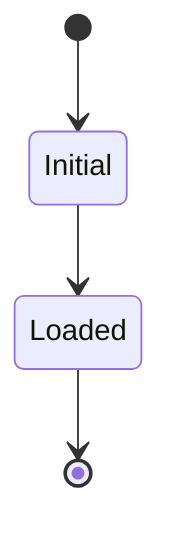

# Plan: {slug}

**Pitch**: pitch.md  •  **Appetite**: {small-batch | big-batch}  •  **Hill**: hill.md

## Scopes

| ID | Name | Files | LOC est | Depends on | Parallel with | Subagent? | Dispatch model |
|----|------|-------|---------|------------|---------------|-----------|----------------|
| S1 | … | … | … | — | — | yes/no + reason | fast/standard/deep (— if no) |

## Exit criteria per scope (machine-checkable, ≥1 per scope)

### S1 — {name}
- {command} exit 0
- {grep / test -f / wc -l check}
- (UI scope) `pnpm build:web` exit 0  ← mandatory for any UI scope
- (Backend scope) relevant test suite passes; no untyped/`any`-equivalent validators introduced
- (AI scope) golden eval case from pitch passes ≥ defined threshold
- Manual: {smoke test, optional}

## Risks (inherited from pitch rabbit holes)

| Risk | Scope | Spike needed? | Mitigation |
|------|-------|---------------|------------|
| {description} | S{N} | yes/no | {strategy} |

## Parallel dispatch plan

- {scope sequencing and parallelism reasoning}

## Wireframes (UI scopes only, light)

ASCII layout + Mermaid state diagram. No component-flow mermaid (the scope table covers it). No pixel-perfect.

```
┌─ Screen ──────────────┐
│ [Header]              │
└───────────────────────┘
```



## Living-spec deviations log

(Empty at /plan time. /build appends as plan diverges from reality.)
